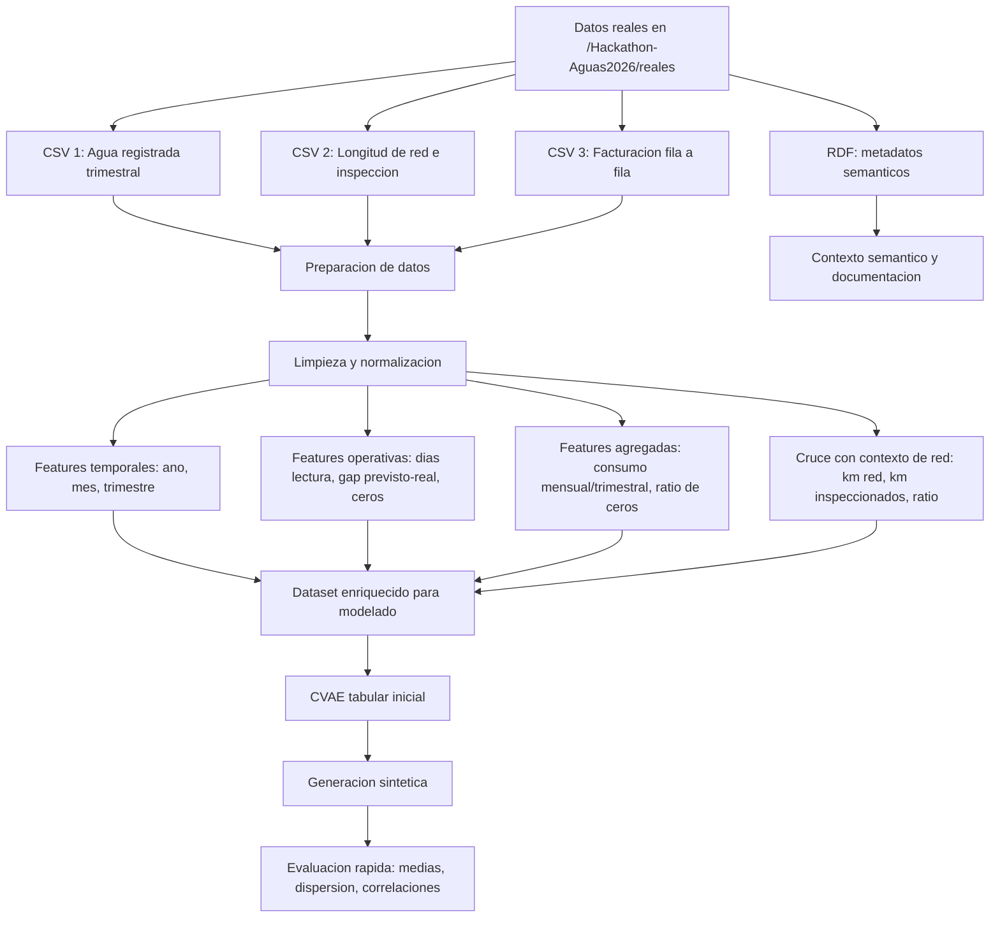
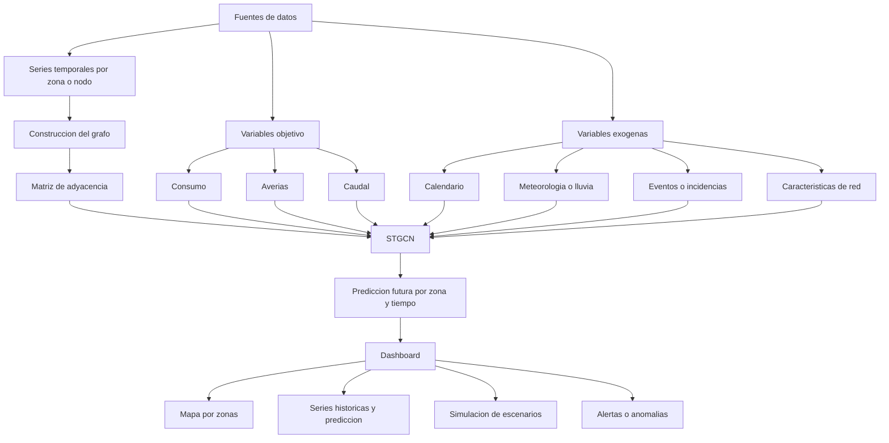
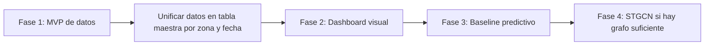
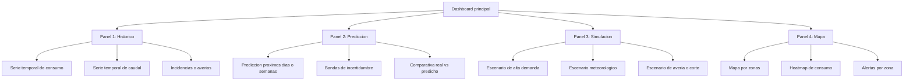
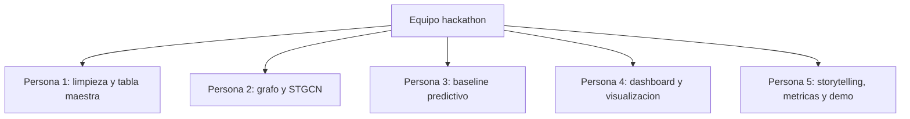

# Diagramas Mermaid para el hackathon

## 1. Flujo actual del pipeline de datos

## 2. Arquitectura objetivo con STGCN

## 3. Plan recomendado del hackathon

## 4. Estructura funcional del dashboard

## 5. Reparto rapido de equipo

